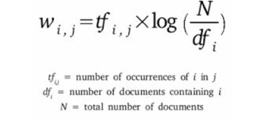

### 1. Introduction

So, if you plan to create chatbots this year, or you want to use the power of unstructured text, this guide is the right starting point.

The aim of the article is to teach the concepts of natural language processing and apply it on real data set. Moreover, we also have a video based [**course on NLP**](https://courses.analyticsvidhya.com/courses/natural-language-processing-nlp?utm_source=blog&utm_medium=ultimate-guide-to-understand-implement-natural-language-processing-codes-in-python) with 3 real life projects.

NLP is a branch of data science that consists of systematic processes for analyzing, understanding, and deriving information from the text data in a smart and efficient manner.

```python
# install nltk
sudo pip install -U nltk
# download nltk data
import nltk  
nltk.download() 
```

### 2. Text Preprocessing

Since, text is the **most unstructured** form of all the available data, various types of noise are present in it and the data is not readily analyzable without any pre-processing. The entire process of **cleaning and standardization** of text, making it noise-free and ready for analysis is known as **text preprocessing**.

It is predominantly comprised of three steps:

- Noise Removal
- Lexicon Normalization
- Object Standardization

#### 2.1 Noise Removal

**Any piece of text which is not relevant to the context of the data and the end-output can be specified as the noise.**

*For example – language stopwords (commonly used words of a language – is, am, the, of, in etc), URLs or links, social media entities (mentions, hashtags), punctuations and industry specific words. This step deals with removal of all types of noisy entities present in the text.*

A general approach for noise removal is to prepare a **dictionary of noisy entities**, and iterate the text object by tokens (or by words), eliminating those tokens which are present in the noise dictionary.

```python
# Sample code to remove noisy words from a text

noise_list = ["is", "a", "this", "..."] 
def _remove_noise(input_text):
    words = input_text.split() 
    noise_free_words = [word for word in words if word not in noise_list] 
    noise_free_text = " ".join(noise_free_words) 
    return noise_free_text

_remove_noise("this is a sample text")
>>> "sample text"
```

Another approach is to use the regular expressions while dealing with special patterns of noise.

```python
# Sample code to remove a regex pattern 
import re 

def _remove_regex(input_text, regex_pattern):
    urls = re.finditer(regex_pattern, input_text) 
    for i in urls: 
        input_text = re.sub(i.group().strip(), '', input_text)
    return input_text

regex_pattern = "#[\w]*"  

_remove_regex("remove this #hashtag from analytics vidhya", regex_pattern)
>>> "remove this  from analytics vidhya"
```

#### 2.2 Lexicon Normalization

词典标准化

Another type of textual noise is about the multiple representations exhibited by single word.

For example – “play”, “player”, “played”, “plays” and “playing” are the different variations of the word – “play”, Though they mean different but contextually all are similar. 

The step converts all the disparities of a word into their **normalized form** (also known as lemma). 

The most common lexicon normalization practices are :

- **Stemming:** Stemming is a rudimentary rule-based process of stripping the suffixes (“ing”, “ly”, “es”, “s” etc) from a word.
- **Lemmatization:** Lemmatization, on the other hand, is an organized & step by step procedure of obtaining the root form of the word, it makes use of vocabulary (dictionary importance of words) and morphological analysis (word structure and grammar relations).

```python
from nltk.stem.wordnet import WordNetLemmatizer 
lem = WordNetLemmatizer()

from nltk.stem.porter import PorterStemmer 
stem = PorterStemmer()

word = "multiplying" 
lem.lemmatize(word, "v")
>> "multiply" 
stem.stem(word)
>> "multipli"
```


#### 2.3 Object Standardization

Text data often contains words or phrases which are not present in any standard lexical dictionaries. These pieces are not recognized by search engines and models.

Some of the examples are – acronyms, hashtags with attached words, and colloquial slangs. With the help of regular expressions and manually prepared data dictionaries, this type of noise can be fixed, the code below uses a dictionary lookup method to replace social media slangs from a text.

```python
lookup_dict = {'rt':'Retweet', 'dm':'direct message', "awsm" : "awesome", "luv" :"love", "..."}
def _lookup_words(input_text):
    words = input_text.split() 
    new_words = [] 
    for word in words:
        if word.lower() in lookup_dict:
            word = lookup_dict[word.lower()]
        new_words.append(word) new_text = " ".join(new_words) 
        return new_text

_lookup_words("RT this is a retweeted tweet by Shivam Bansal")
>> "Retweet this is a retweeted tweet by Shivam Bansal"
```

but cc for credit card, while 'accept' is not

### 3. Text to Features (Feature Engineering on text data)

To analyse a preprocessed data, it needs to be converted into features. Depending upon the usage, text features can be constructed using assorted techniques – **Syntactical Parsing, Entities / N-grams / word-based features, Statistical features, and word embeddings.**

#### 3.1 Syntactic Parsing

Syntactical parsing involves the analysis of words in the sentence for grammar and their arrangement in a manner that shows the relationships among the words. Dependency Grammar and Part of Speech tags are the important attributes of text syntactics.

- **Dependency Trees**:   Dependency grammar is a class of syntactic text analysis that deals with (labeled) asymmetrical binary relations between two lexical items (words). Every relation can be represented in the form of a **triplet** (relation, governor, dependent).
  The python wrapper [StanfordCoreNLP](http://stanfordnlp.github.io/CoreNLP/) (by Stanford NLP Group, only commercial license) and NLTK dependency grammars can be used to generate dependency trees.
- **Part of speech tagging**:  Apart from the grammar relations, every word in a sentence is also associated with a part of speech (pos) tag (nouns, verbs, adjectives, adverbs etc). The pos tags defines the usage and function of a word in the sentence.

#### 3.2 Entity Extraction (Entities as features)

Entities are defined as the most important chunks of a sentence – noun phrases, verb phrases or both. Entity Detection algorithms are generally **ensemble models** of rule based parsing, dictionary lookups, pos tagging and dependency parsing. The applicability of entity detection can be seen in the automated **chat bots**, content analyzers and consumer insights.

- **Named Entity Recognition (NER)**:  The process of detecting the named entities such as person names, location names, company names etc from the text is called as NER.

- **Topic Modeling**： Topic modeling is a process of automatically identifying the topics present in a text corpus（语料库）, it derives the hidden patterns among the words in the corpus in an unsupervised manner. Topics are defined as “a repeating pattern of co-occurring terms in a corpus”. A good topic model results in – “health”, “doctor”, “patient”, “hospital” for a topic – Healthcare, and “farm”, “crops”, “wheat” for a topic – “Farming”.
  Latent Dirichlet Allocation (LDA) is the most popular topic modelling technique, Following is the code to implement topic modeling using LDA in python.

  ```python
  doc1 = "Sugar is bad to consume. My sister likes to have sugar, but not my father." 
  doc2 = "My father spends a lot of time driving my sister around to dance practice."
  doc3 = "Doctors suggest that driving may cause increased stress and blood pressure."
  doc_complete = [doc1, doc2, doc3]
  doc_clean = [doc.split() for doc in doc_complete]
  
  import gensim from gensim
  import corpora
  
  # Creating the term dictionary of our corpus, where every unique term is assigned an index.  
  dictionary = corpora.Dictionary(doc_clean)
  
  # Converting list of documents (corpus) into Document Term Matrix using dictionary prepared above. 
  doc_term_matrix = [dictionary.doc2bow(doc) for doc in doc_clean]
  
  # Creating the object for LDA model using gensim library
  Lda = gensim.models.ldamodel.LdaModel
  
  # Running and Training LDA model on the document term matrix
  ldamodel = Lda(doc_term_matrix, num_topics=3, id2word = dictionary, passes=50)
  
  # Results 
  print(ldamodel.print_topics())
  ```

  

- **N-Grams as Features**: A combination of N words together are called N-Grams. N grams (N > 1) are generally more informative as compared to words (Unigrams) as features. Also, bigrams (N = 2) are considered as the most important features of all the others. 

  ```python
  def generate_ngrams(text, n):
      words = text.split()
      output = []  
      for i in range(len(words)-n+1):
          output.append(words[i:i+n])
      return output
  
  >>> generate_ngrams('this is a sample text', 2)
  # [['this', 'is'], ['is', 'a'], ['a', 'sample'], , ['sample', 'text']] 
  ```

#### 3.3 Statistical Features

- **Term Frequency – Inverse Document Frequency (TF – IDF)**： TF-IDF is a weighted model commonly used for information retrieval problems. It aims to convert the text documents into vector models on the basis of occurrence of words in the documents without taking considering the exact ordering. For Example – let say there is a dataset of N text documents, In any document “D”, TF and IDF will be defined as –
  **Term Frequency (TF)** – TF for a term “t” is defined as the count of a term “t” in a document “D”
  **Inverse Document Frequency (IDF**) – IDF for a term is defined as logarithm of ratio of total documents available in the corpus and number of documents containing the term T.
  

  ```python
  from sklearn.feature_extraction.text import TfidfVectorizer
  obj = TfidfVectorizer()
  corpus = ['This is sample document.', 'another random document.', 'third sample document text']
  X = obj.fit_transform(corpus)
  print X
  >>>
  (0, 1) 0.345205016865
  (0, 4) ... 0.444514311537
  (2, 1) 0.345205016865
  (2, 4) 0.444514311537
  ```

  

- **Count / Density / Readability Features**： 

Count or Density based features can also be used in models and analysis. These features might seem **trivial** but shows a great **impact** in learning models. Some of the features are: Word Count, Sentence Count, Punctuation Counts and Industry specific word counts. Other types of measures include readability measures such as syllable counts, smog index and flesch reading ease. Refer to [Textstat](https://github.com/shivam5992/textstat) library to create such features.

#### 3.4 Word Embedding (text vectors)

Word embedding is the **modern** way of representing words as vectors. The aim of word embedding is to redefine the high dimensional word features into low dimensional feature vectors by preserving the contextual similarity in the corpus. **They are widely used in deep learning models such as Convolutional Neural Networks and Recurrent Neural Networks.**

[Word2Vec](https://code.google.com/archive/p/word2vec/) and [GloVe](http://nlp.stanford.edu/projects/glove/) are the two popular models to create word embedding of a text. These models **takes a text corpus as input and produces the word vectors** as output.

Word2Vec model is composed of preprocessing module, a shallow neural network model called Continuous Bag of Words and another shallow neural network model called skip-gram. These models are widely used for all other nlp problems. It first constructs a vocabulary from the training corpus and then learns word embedding representations. 

```python
from gensim.models import Word2Vec
sentences = [['data', 'science'], ['vidhya', 'science', 'data', 'analytics'],['machine', 'learning'], ['deep', 'learning']]

# train the model on your corpus  
model = Word2Vec(sentences, min_count = 1)

print model.similarity('data', 'science')
>>> 0.11222489293

print model['learning']  
>>> array([ 0.00459356  0.00303564 -0.00467622  0.00209638, ...])
```

### 4. Important tasks of NLP

#### 4.1 Text Classification

**Text classification** is one of the classical problem of NLP. Notorious examples include – **Email Spam Identification**, **topic classification of news**, **sentiment classification** and **organization of web pages by search engines**.

Text classification, in common words is defined as a technique to systematically classify a text object (document or sentence) in one of the **fixed category**. 

```python
# nltk
from textblob.classifiers import NaiveBayesClassifier as NBC
from textblob import TextBlob
training_corpus = [
                   ('I am exhausted of this work.', 'Class_B'),
                   ("I can't cooperate with this", 'Class_B'),
                   ('He is my badest enemy!', 'Class_B'),
                   ('My management is poor.', 'Class_B'),
                   ('I love this burger.', 'Class_A'),
                   ('This is an brilliant place!', 'Class_A'),
                   ('I feel very good about these dates.', 'Class_A'),
                   ('This is my best work.', 'Class_A'),
                   ("What an awesome view", 'Class_A'),
                   ('I do not like this dish', 'Class_B')]
test_corpus = [
                ("I am not feeling well today.", 'Class_B'), 
                ("I feel brilliant!", 'Class_A'), 
                ('Gary is a friend of mine.', 'Class_A'), 
                ("I can't believe I'm doing this.", 'Class_B'), 
                ('The date was good.', 'Class_A'), ('I do not enjoy my job', 'Class_B')]

model = NBC(training_corpus) 
print(model.classify("Their codes are amazing."))
>>> "Class_A" 
print(model.classify("I don't like their computer."))
>>> "Class_B"
print(model.accuracy(test_corpus))
>>> 0.83 

# sklearn
from sklearn.feature_extraction.text
import TfidfVectorizer from sklearn.metrics
import classification_report
from sklearn import svm 

# preparing data for SVM model (using the same training_corpus, test_corpus from naive bayes example)
train_data = []
train_labels = []
for row in training_corpus:
    train_data.append(row[0])
    train_labels.append(row[1])

test_data = [] 
test_labels = [] 
for row in test_corpus:
    test_data.append(row[0]) 
    test_labels.append(row[1])

# Create feature vectors 
vectorizer = TfidfVectorizer(min_df=4, max_df=0.9)
# Train the feature vectors
train_vectors = vectorizer.fit_transform(train_data)
# Apply model on test data 
test_vectors = vectorizer.transform(test_data)

# Perform classification with SVM, kernel=linear 
model = svm.SVC(kernel='linear') 
model.fit(train_vectors, train_labels) 
prediction = model.predict(test_vectors)
>>> ['Class_A' 'Class_A' 'Class_B' 'Class_B' 'Class_A' 'Class_A']

print (classification_report(test_labels, prediction))
```

#### 4.2 Text Matching / Similarity

One of the important areas of NLP is the matching of text objects to find similarities. Important applications of text matching includes automatic **spelling correction**, **data de-duplication** and **genome analysis** etc.

- **Levenshtein Distance** – （编辑距离）The Levenshtein distance between two strings is defined as the minimum number of edits needed to transform one string into the other, with the allowable edit operations being insertion, deletion, or substitution of a single character. Following is the implementation for efficient memory computations.

  ```python
  def levenshtein(s1,s2): 
      if len(s1) > len(s2):
          s1,s2 = s2,s1 
      distances = range(len(s1) + 1) 
      for index2,char2 in enumerate(s2):
          newDistances = [index2+1]
          for index1,char1 in enumerate(s1):
              if char1 == char2:
                  newDistances.append(distances[index1]) 
              else:
                   newDistances.append(1 + min((distances[index1], distances[index1+1], newDistances[-1]))) 
          distances = newDistances 
      return distances[-1]
  
  print(levenshtein("analyze","analyse"))
  ```

- **Phonetic Matching** – （发音匹配）A Phonetic matching algorithm takes a keyword as input (person’s name, location name etc) and produces a character string that identifies a set of words that are (roughly) phonetically similar. It is very useful for searching large text corpuses, correcting spelling errors and matching relevant names. Soundex and Metaphone are two main phonetic algorithms used for this purpose. Python’s module Fuzzy is used to compute soundex strings for different words, for example –

  ```python
  import fuzzy 
  soundex = fuzzy.Soundex(4) 
  print soundex('ankit')
  >>> “A523”
  print soundex('aunkit')
  >>> “A523” 
  ```

- **Flexible String Matching** – A complete text matching system includes different algorithms pipelined together to compute variety of text variations. **Regular expressions** are really helpful for this purposes as well. Another common techniques include – exact string matching, lemmatized matching, and compact matching (takes care of spaces, punctuation’s, slangs etc).

- **Cosine Similarity** – W hen the text is represented as vector notation, a general cosine similarity can also be applied in order to measure vectorized similarity. Following code converts a text to vectors (using term frequency) and applies cosine similarity to provide closeness among two text.

  ```python
  import math
  from collections import Counter
  def get_cosine(vec1, vec2):
      common = set(vec1.keys()) & set(vec2.keys())
      numerator = sum([vec1[x] * vec2[x] for x in common])
  
      sum1 = sum([vec1[x]**2 for x in vec1.keys()]) 
      sum2 = sum([vec2[x]**2 for x in vec2.keys()]) 
      denominator = math.sqrt(sum1) * math.sqrt(sum2)
     
      if not denominator:
          return 0.0 
      else:
          return float(numerator) / denominator
  
  def text_to_vector(text): 
      words = text.split() 
      return Counter(words)
  
  text1 = 'This is an article on analytics vidhya' 
  text2 = 'article on analytics vidhya is about natural language processing'
  
  vector1 = text_to_vector(text1) 
  vector2 = text_to_vector(text2) 
  cosine = get_cosine(vector1, vector2)
  >>> 0.62 
  ```

  #### 4.3 Coreference Resolution

  Coreference Resolution is a process of **finding relational links among the words** (or phrases) **within the sentences**.

  Consider an example sentence: ” Donald went to John’s office to see the new table. He looked at it for an hour.“

  Humans can quickly figure out that “he” denotes Donald (and not John), and that “it” denotes the table (and not John’s office). Coreference Resolution is the component of NLP that does this job automatically. It is used in document summarization, question answering, and information extraction. Stanford CoreNLP provides a python [wrapper](https://github.com/Wordseer/stanford-corenlp-python) for commercial purposes.

#### 4.4 Other NLP problems / tasks

- **Text Summarization** – Given a text article or paragraph, summarize it automatically to produce most important and relevant sentences in order.
- **Machine Translation** – Automatically translate text from one human language to another by taking care of grammar, semantics and information about the real world, etc.
- **Natural Language Generation and Understanding** – Convert information from computer databases or semantic intents into readable human language is called language generation. Converting chunks of text into more logical structures that are easier for computer programs to manipulate is called language understanding.
- **Optical Character Recognition** – Given an image representing printed text, determine the corresponding text.
- **Document to Information** – This involves parsing of textual data present in documents (websites, files, pdfs and images) to analyzable and clean format.

### 5. Important Libraries for NLP (python)

- Scikit-learn: Machine learning in Python
- Natural Language Toolkit (NLTK): The complete toolkit for all NLP techniques.
- Pattern – A web mining module for the with tools for NLP and machine learning.
- TextBlob – Easy to use nl p tools API, built on top of NLTK and Pattern.
- spaCy – Industrial strength N LP with Python and Cython.
- Gensim – Topic Modelling for Humans
- Stanford Core NLP – NLP services and packages by Stanford NLP Group.


reference： https://www.analyticsvidhya.com/blog/2017/01/ultimate-guide-to-understand-implement-natural-language-processing-codes-in-python/